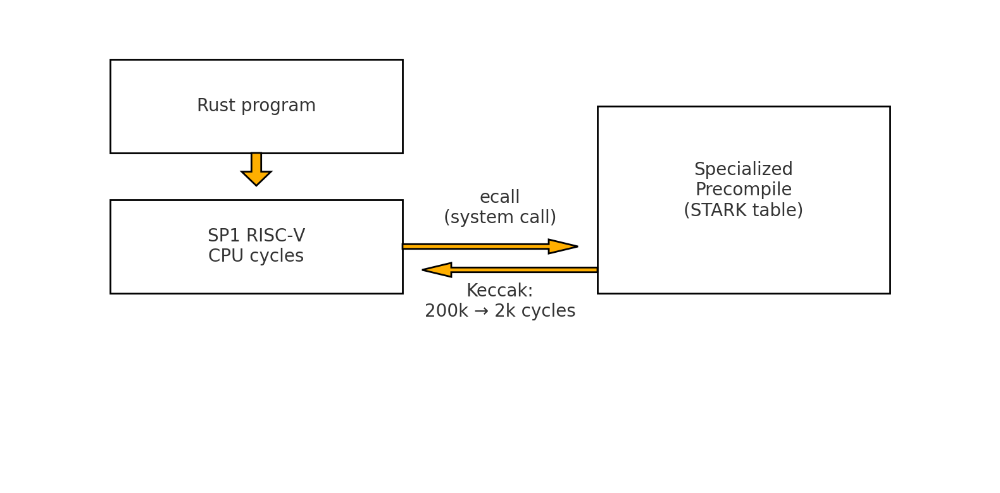
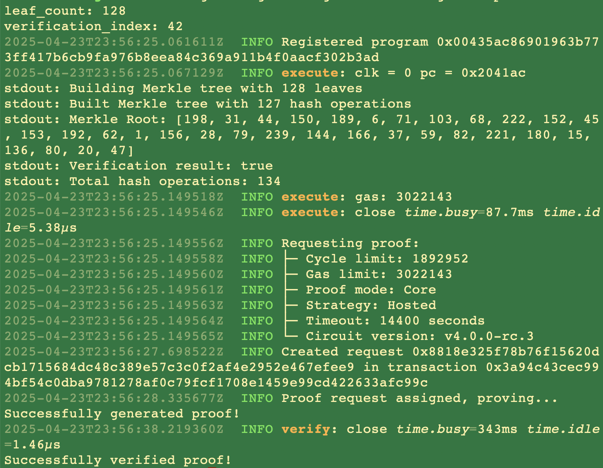
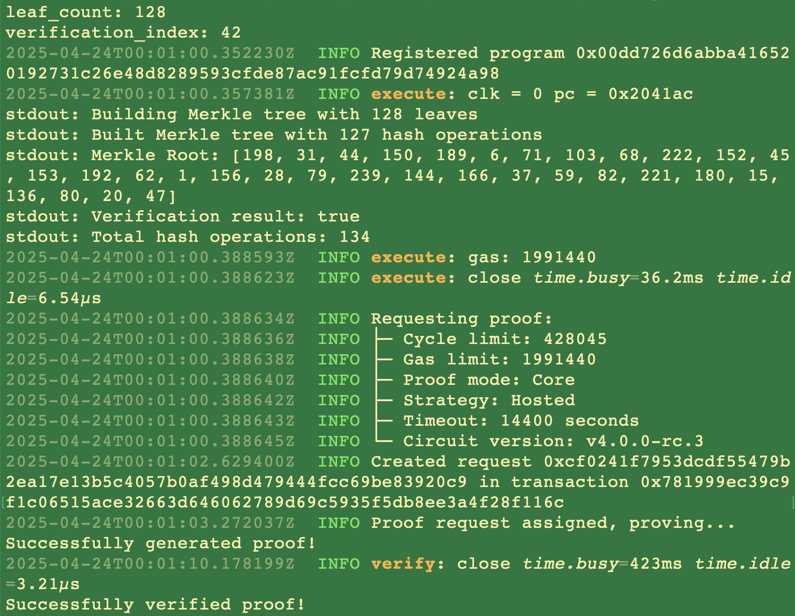

# On SP1’s Precompiles

### Introduction

SP1’s precompiles draw inspiration from the earliest days of Ethereum while delivering on critical sets of improvements. They offer the correct middle ground between custom circuits and generalizable zkVMs: combining safety and efficiency to improve the developer experience. 

In this blog, let’s go over their technical specifications, see them deliver real-world performance improvements, and conclude on a historical comparison. 

### It's One + The other

An application developer looking to leverage programmable cryptography currently has two options: write a “bespoke” circuit using a DSL, where the only operations allowed are those defined in the circuit; or running their code on a zkVM, which can prove an arbitrarily complex set of instructions. The latter of which is compiled into a “common” instruction set and run through the zkVM’s proving system. This “choice” between the two is a false dichotomy, let’s explore why. 

### Historical Precedent

As mentioned, Ethereum itself struggled with a particular problem: how can we execute these complex, computationally intensive, cryptographic operations without going through the EVM. The gas cost of a hashing algorithm alone would be prohibitively expensive and thus never get used. 

They landed on precompiled programs. These programs are executed at the client level (say on Geth), instead of being run on the EVM itself. However, this isn’t scalable. Due to their inclusion (not execution) at the protocol level, developers must wait on core devs to agree to implement it, and on a hard fork to actually make it available.

### Developer's Dilemma

At first, developers looking to squeeze out efficiency from their computation intensive tasks, like hashing algorithms, might default to circuits. Indeed, these have been hand-optimized through clever math and coding tricks to deliver orders of magnitude faster performance than sequentially running each necessary step. 

The rest of their code however would require the same level of stringent detail, and development time starts to balloon.
This is where precompiles come in –– generalized circuits that stand adjacent to our zkVM –– where we may offload frequently used operations.

### Technical Specifications

How exactly does SP1 achieve this? Let’s briefly cover SP1 and where precompiles fit in. 

Users write their program in Rust, which gets compiled down to RISC-V Assembly code. This code is then translated into an execution trace, represented by tables detailing every intermediate step or state transition of the computation. Each state transition or computational step is captured as a distinct row within these tables.

Constraints are logical rules or relationships that tie these steps together. They ensure consistency across tables, encoding the correctness of the computation. Together, tables and constraints provide a structured representation of program execution, which allows the entire computation to be efficiently and cryptographically verifiable.


Once the code encounters a precompile it searches from a list of pre-established tables instead of recomputing the whole trace itself. More specifically, SP1 outsources the precompile the the RISC-V executes a syscall, and These lookup tables are nothing more than custom circuits themselves! Then we join the result of these precompiles (specialized STARKs) back to the regular execution of the RISC-V Assembly (which once again consists of its own set of tables and constraints) and the result of all of those is finally bundled into its own STARK proof. 



We can now guarantee that, as long as the precompile table is properly written, executing our SP1 program will yield the exact same expected result, with orders of magnitude fewer cycles of tables and constraints being built.

SP1 gives you total freedom over what to precompile and what to run dynamically. 

### Illustrative Toy Example

Now (for the purpose of illustration, not production) let’s run a real-world example of a Merkle Tree construction and verification of a single leaf, using SHA256. We’ll run this benchmark on the Prover Network to establish the strongest foundation.

Here’s our first run:



And here’s our second:



To be clear, here’s the breakdown:
- 1st Run (without precompile):
    - Gas: 3022143
    - Cycle limit: 1892952
    - time.busy: 87.7ms (execution time)
    - time.busy: 343ms (verification time)

- 2nd Run (with precompile):
    - Gas: 1991440
    - Cycle limit: 428045
    - time.busy: 36.2ms (execution time)
    - time.busy: 423ms (verification time)

So the precompile version shows:
- Gas usage reduced from 3022143 to 1991440 (about 34% reduction)
- Cycle limit reduced from 1892952 to 428045 (about 77% reduction)
- Execution time reduced from 87.7ms to 36.2ms (about 59% faster)
- Verification time slightly increased from 343ms to 423ms

How was this significant performance improvement achieved? Two lines in the root Cargo.toml:
``` 
[patch.crates-io]
sha2-v0-10-8 = { git = "https://github.com/sp1-patches/RustCrypto-hashes", package = "sha2", tag = "patch-sha2-0.10.8-sp1-4.0.0" } 
```

### Historical Note

We take it for granted these days that TCP/IP is the default networking protocol used for global communication. This was far from a given, with serious competition by the OSI Model, a more “elegant” technical solution supported by “stronger” standards. Yet as history shows, the high complexity of OSI lost out to the simple and practical TCP/IP model. We see some parallels here between the two “sides” of this current debate. And the truth isn’t so simple here, in particular *because* of precompiles. As we already see, critical crates have been patched and allow developers to improve their performance right out of the gate. It’s easy to imagine that further programs that are highly sought after will get precompiled as well. What’s most extensible is ofter most standardizable, and will ultimately “win” out on adoption.


