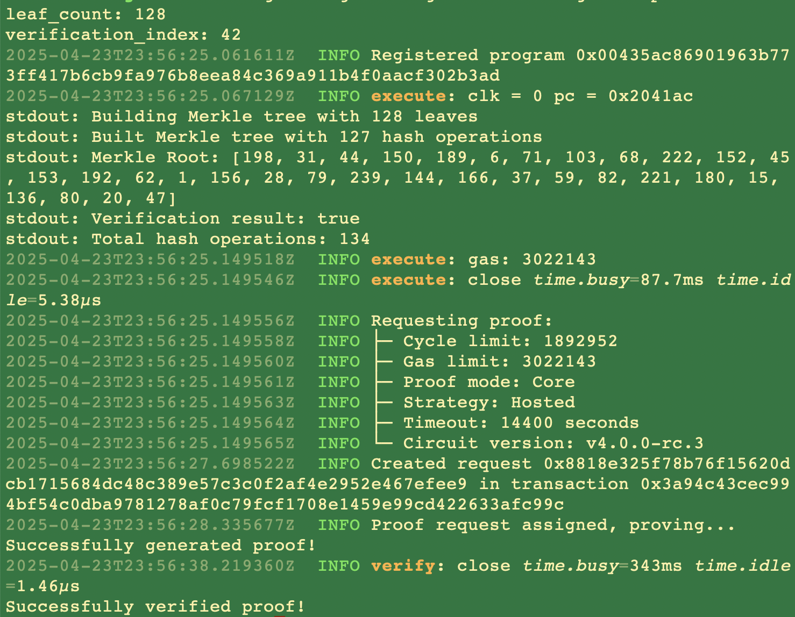
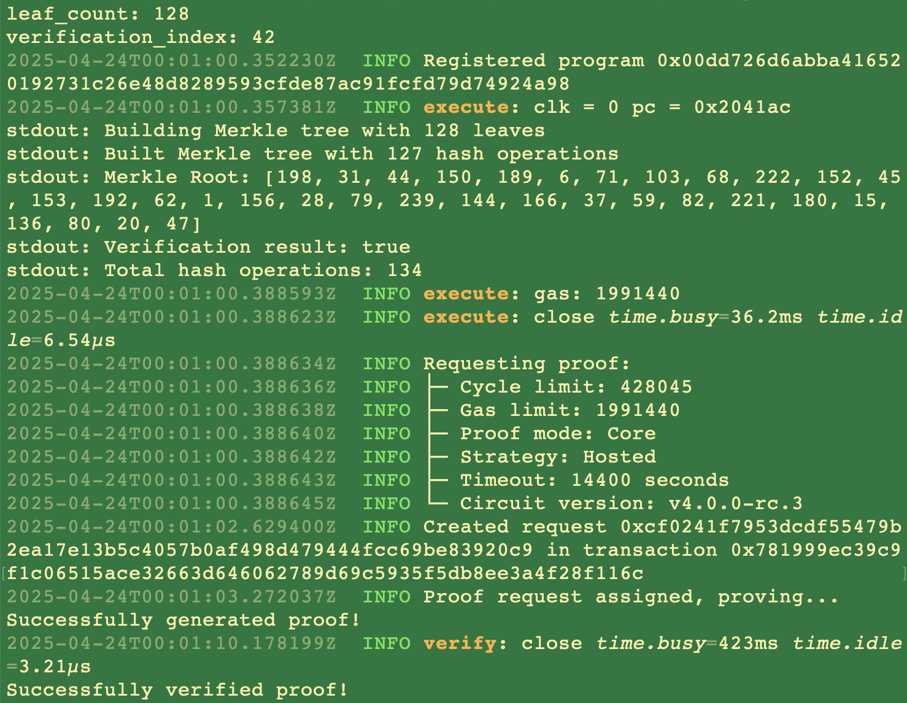
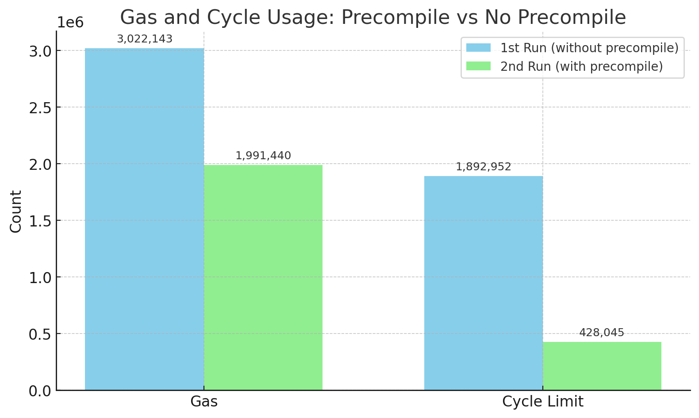
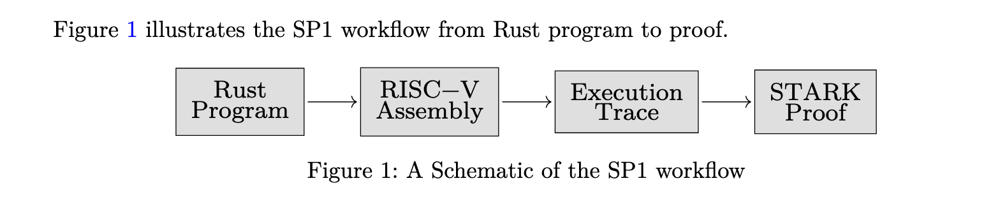
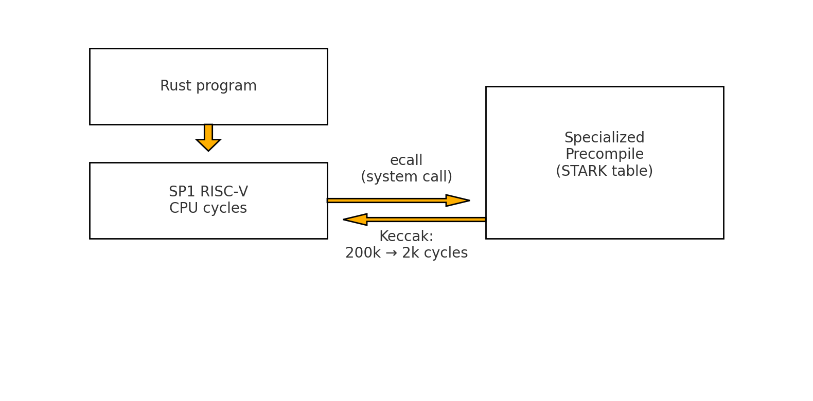

# On SP1’s Precompiles

### Introduction

With two lines of codes, developers can reduce the cycle cost of verifiable compute by at least 77%, with 59% faster execution. All thanks to SP1's precompiles. And it costs pennies on the new Prover Network.

SP1’s precompiles deliver critical improvements to zk development. They offer the optimal middle ground between custom circuits and generalizable zkVMs: combining safety and efficiency to improve the developer experience. 

In this blog, we'll go over their technical specifications and see them deliver real-world performance improvements. 

### It's One + The Other

An application developer looking to leverage programmable cryptography currently has two options: write a “bespoke” circuit using a DSL, where the only operations allowed are those defined in the circuit; or run their code on a zkVM, which can prove an arbitrarily complex set of instructions. This “choice” between the two is a false dichotomy, let’s explore why. 

### Developer's Dilemma

Developers looking for efficiency from their computation-heavy tasks, like hashing algorithms, might default to circuits. Custom circuits are hand-optimized through clever math and coding tricks to deliver orders of magnitude faster performance, compared to sequentially running each necessary step in a zkVM. 

The rest of their code, however, would require the same level of stringent detail, and development time balloons.
This is where precompiles come in — generalized circuits that stand adjacent to our zkVM — where we may offload frequently used operations.

### Illustrative Toy Example

Now (for the purpose of illustration, not production) let’s run a program that uses a common cryptographic algorithm, SHA-256. We'll construct a Merkle tree from a given leaf, generate a proof of inclusion for that specific leaf, verify the proof against the Merkle root, and encode and output public values for external verification.

We’ll run this on the Prover Network to establish the strongest foundation for our benchmarks.

Here’s our first run:



And here’s our second:



To be clear, here’s the breakdown:
- 1st Run (without precompile):
    - Gas: 3,022,143
    - Cycle limit: 1,892,952
    - time.busy: 87.7ms (execution time)

- 2nd Run (with precompile):
    - Gas: 1,991,440
    - Cycle limit: 428,045
    - time.busy: 36.2ms (execution time)

So the precompile version shows:
- Gas usage reduced from 3,022,143 to 1,991,440 (about 34% reduction)
- Cycle limit reduced from 1,892,952 to 428,045 (about 77% reduction)
- Execution time reduced from 87.7ms to 36.2ms (about 59% faster)



How was this significant performance improvement achieved? **Two simple lines of code** in the root ```Cargo.toml```:
``` 
[patch.crates-io]
sha2-v0-10-8 = { git = "https://github.com/sp1-patches/RustCrypto-hashes", package = "sha2", tag = "patch-sha2-0.10.8-sp1-4.0.0" } 
```

The remainder of the code can be found at [github.com/ibansadowski/angela](https://github.com/ibansadowski/angela). 

A list of existing precompiles and their associated patched crates can be found here: [Patched Crates](https://docs.succinct.xyz/docs/sp1/optimizing-programs/precompiles#patched-crates).
They include tiny-keccak, bls12_381, and rsa. 

Clearly, in terms of development speed and program execution speed, zkVMs with precompiles are in a league of their own.

### Technical Specifications

How exactly does SP1 achieve this? Let’s briefly cover SP1 and where precompiles fit in. First, some definitions:

- *Execution Trace*: A table representation, detailing every intermediate step or state transition of the computation. Each state transition or computational step is captured as a distinct row within these tables.

- *Constraints*: Logical rules or relationships that tie these steps, and other tables, together. They ensure consistency across tables by encoding the correctness of the computation.

Together, tables and constraints provide a structured representation of program execution, which allows the entire computation to be efficiently and cryptographically verifiable. The final result of generating a proof from a union of tables and constraints is a STARK proof.

Users write their program in Rust, which gets compiled down to RISC-V Assembly code. This code is then translated into an execution trace and its associated constraints.



Once the code execution encounters a precompile, it short-circuits (HA!!) out to an existing table. Instead of recomputing the whole trace itself, SP1 executes a syscall within the RISC-V runtime. This redirects the code execution to a highly-optimized, pre-established lookup table. These lookup tables are nothing more than custom circuits themselves! 



These circuits (specialized STARKs) accelerate the rate of computation, since the tables have been precomputed. After executing the precompile, SP1 reintegrates the results back into the main RISC-V execution trace. This is possible since precompiles can directly read/write memory. 
Finally, both the precompile trace and the main trace are bundled together into a unified STARK proof.

We can now guarantee that (assuming the precompile is written correctly) executing our SP1 program yields the expected results. With orders of magnitude fewer cycles of tables and constraints being built.

SP1 gives you total freedom over what to precompile and what to run dynamically.


To conclude, SP1's precompiles deliver the immediate efficiency of custom circuits, while being wrapped up in the flexibility of zkVMs. We can expect popular programs to turn into precompiles themselves. Hence development time will trend downwards thanks to precompiles.  
### Historical Note

We take it for granted these days that TCP/IP is the default networking protocol used for global communication. This was far from a given, with serious competition by the OSI Model, a more “elegant” technical solution supported by “stronger” standards. Yet as history shows, the high complexity of OSI lost out to the simple and practical TCP/IP model. We see some parallels here between the two “sides” of this current debate. And the truth isn’t so simple here, in particular *because* of precompiles. What’s most extensible is often most standardizable, and will ultimately “win” out on adoption.

